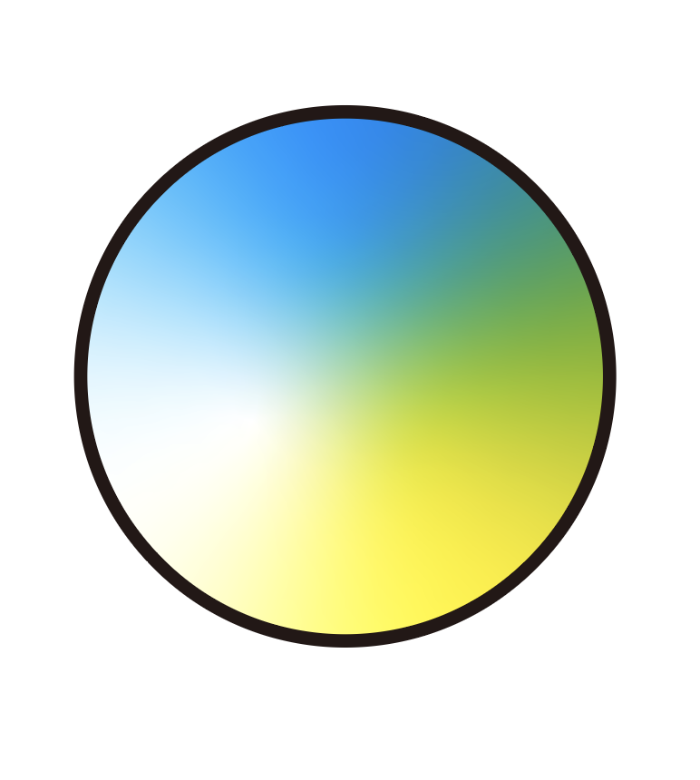
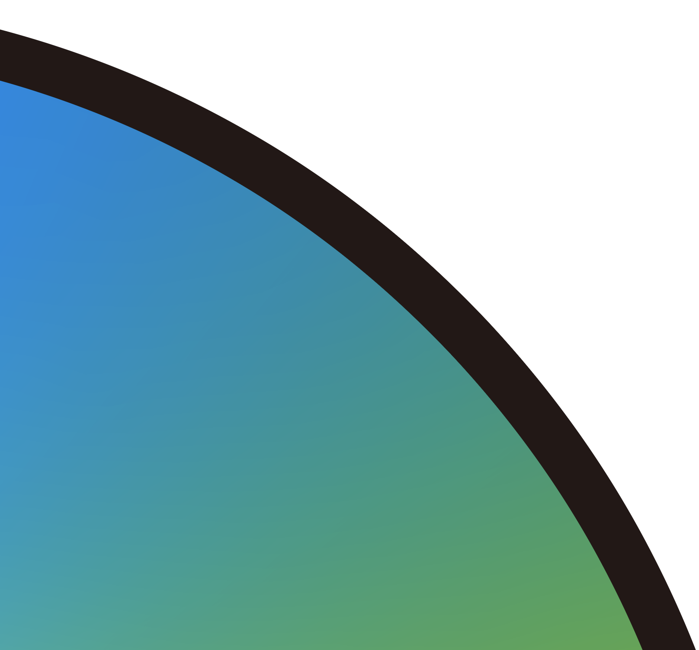
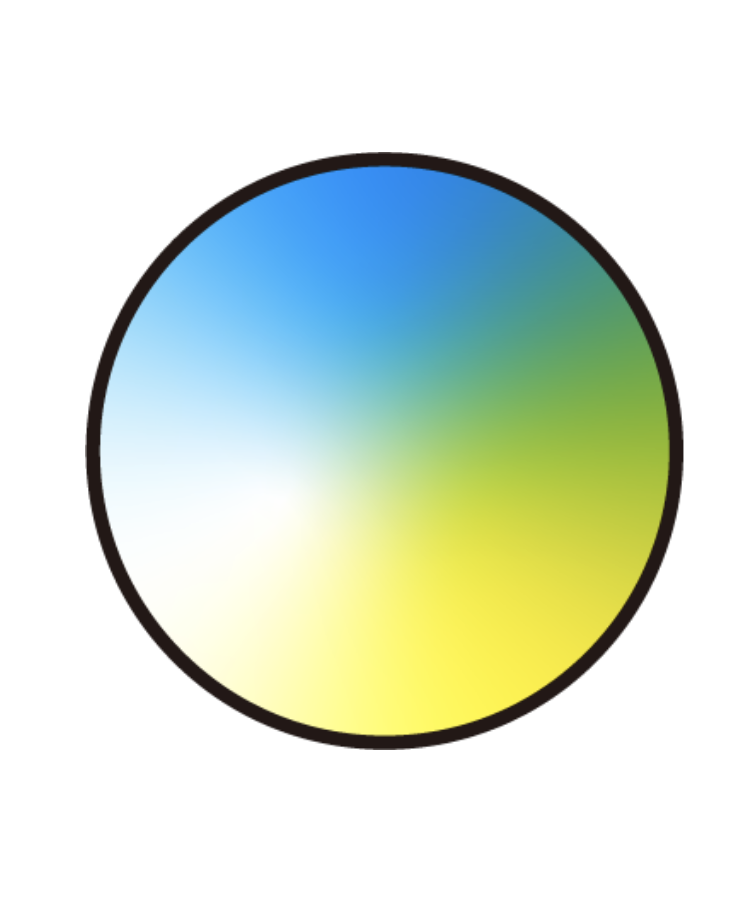
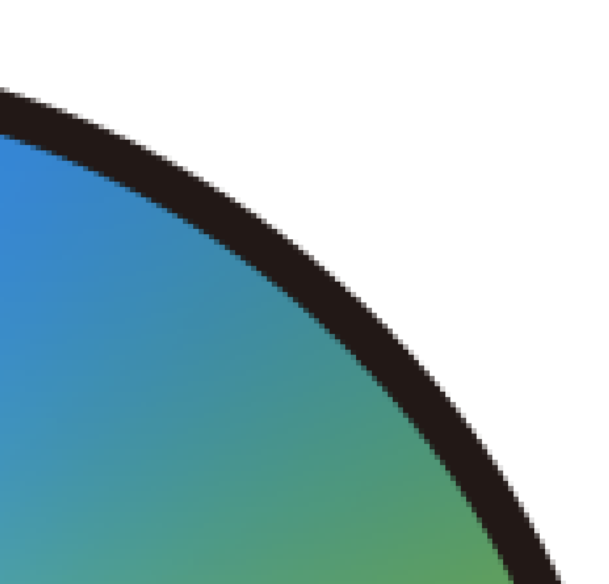

# **1-1. ベクターとラスター**

パソコンで作成できる画像データは大きく分けて、「ベクター画像」と「ラスター画像」の2種類があります。

## **(1) ベクター画像**

点（ノード、アンカー）と点とつなぐ線（パス）と、塗りで構成されており、拡大を繰り返しても画像が劣化しません。例えば企業のロゴ等のように、様々なサイズで使用される画像の場合はベクター画像が向いています。レーザーカッターやカッティングプロッタ等で素材を切断加工したい場合には、ベクター画像であることが必須条件です。

<table>
  <tr>
   <td>

   </td>
   <td>画像の一部を

16倍に拡大

▶︎
   </td>
   <td>

   </td>
  </tr>
</table>

［保存形式］

.pdf, .svg, .ai, .dxf など

［ソフトウェア例］

*   [Inkscape](https://inkscape.org/ja/) \
無料。ダウンロード利用。会員登録不要。オープンソースソフトウェア。 \
Adobe Illustratorの代用品としてよく使われています。
*   [Method Draw](https://editor.method.ac/) \
無料。ブラウザ上で利用可能。会員登録不要。オープンソースソフトウェア。 \
Inkscapeより手軽に利用可能ですが、合体等の一部機能がありません。
*   [Adobe Illustrator](https://www.adobe.com/jp/products/illustrator.html) \
有料。ダウンロード利用。最も利用されているベクター画像ソフトウェアです。
*   Power PointやGoogleスライド等のプレゼンテーション作成ソフトウェア \
保存形式によっては、ベクター画像として使用可能です。

## **(2) ラスター画像**

モザイクのような小さな点（ピクセル（画素））で構成されており、どんどん拡大していくと、画像が荒く見えるようになります。ラスター画像は、写真やグラデーションが多用された画像など、色や濃淡の変化を滑らかに見せたい際に使われます。レーザーカッターで素材を彫刻加工したい場合には、ラスター画像でも使用可能です。

<table>
  <tr>
   <td>

   </td>
   <td>画像の一部を

16倍に拡大

▶︎
   </td>
   <td>

   </td>
  </tr>
</table>

［保存形式］

.jpg, .png, .bmp, .gif, .psd など

［ソフトウェア例］

*   [krita](https://krita.org/jp/) \
無料。ダウンロード利用。会員登録不要。オープンソースソフトウェア。 \
ペイント用ソフトで、様々な形状のブラシなども用意されています。
*   [GIMP](https://www.gimp.org/) \
無料。ダウンロード利用。会員登録不要。オープンソースソフトウェア。 \
最低限のイラストの作成に加えて、写真等の画像加工も可能です。
*   [Adobe Photoshop](https://www.adobe.com/jp/products/photoshop.html) \
有料。ダウンロード利用。写真等の画像の加工・修正にもよく利用されています。
*   Power PointやGoogleスライド等のプレゼンテーション作成ソフトウェア \
保存形式によっては、ラスター画像として使用可能です。
