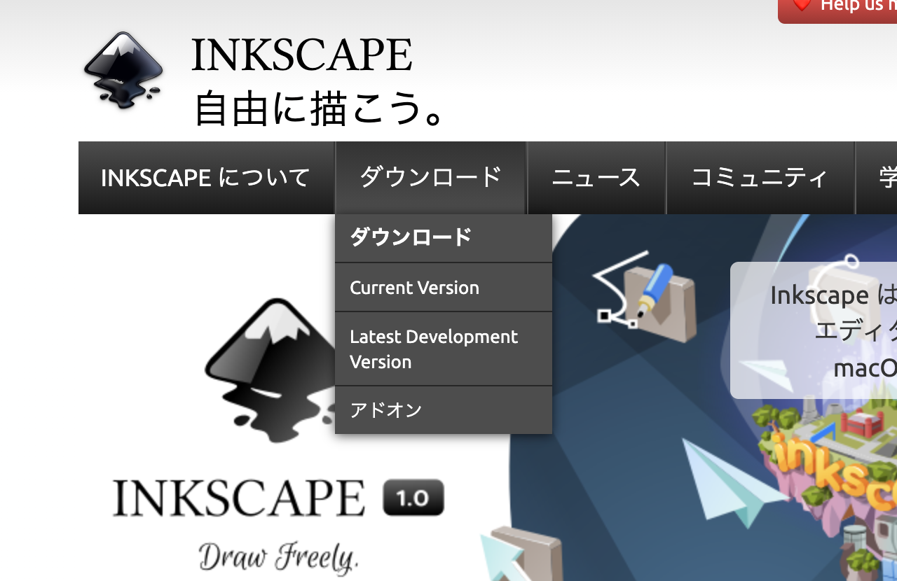
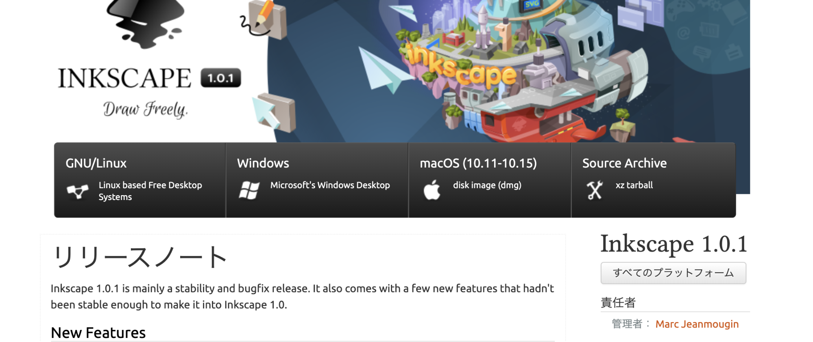

# **1-5.  ツールのセットアップ**

ここまで様々なソフトやツールを紹介してきましたが、今回のコースでは「[Inkscape](https://inkscape.org/ja/)」を使用します。

#### 1. Inkscapeのウェブサイトにアクセスする。 
[https://inkscape.org/ja/](https://inkscape.org/ja/)
#### 2. 上部メニューの「ダウンロード」をクリック。

#### 3. 使用するパソコンに合わせたインストーラーを選択する。

    

#### 4. ダウンロードが完了したら、インストーラーが起動するので、指示に従ってインストールを完了させる。
#### 5. Inkscapeが正しくインストールされていれば、スタートメニューやアプリケーションから起動することができる。
