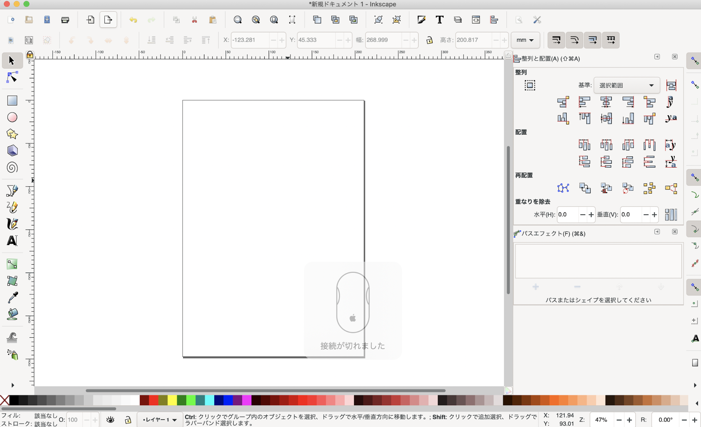
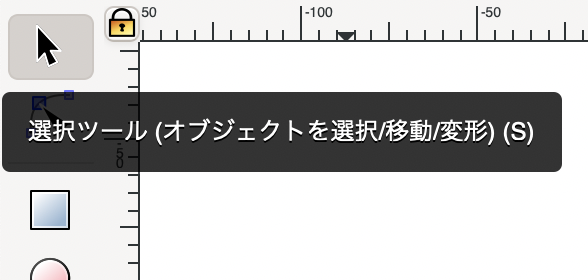

# **2-1. 画面の見方とマウス操作ついて**

<table>
  <tr>
   <td>

   </td>

   <td>起動するとこんな画面が表示されます。
表示言語やウィンドウの色味については、
上部メニューの

“Inkscape” > “Inkscapeの設定”

で変更可能です。
   </td>
  </tr>
  <tr>
   <td>

   </td>

   <td>オブジェクト（画像）の選択・移動・変形には、左側のツールバーの“選択ツール”を使用します。Shiftキーを押しながら複数のオブジェクトをクリックすると、同時に選択することが可能です。
   </td>
  </tr>
</table>

<ul>
<li>画面の移動：スペースキーを押しながら左または右ドラッグ

→もしできない場合は、“Inkscape” > “Inkscapeの設定” > “振る舞い” > “スクロール”
　を開き、“Mouse move pans ~ ”という項目にチェックを入れる。

<li>画面の拡大：マウスホイールを押す

<li>画面の縮小：Shiftキーを押しながらマウスホイールを押す

→または、左のツールバーの下部に隠しメニューとして用意されている“ズーム”を
　使用する。（その場合もShiftキーを押すと縮小可能）

<li>コピー：Ctrl + C

<li>切り取り：Ctrl + X

<li>貼り付け：Ctrl + V

<li>複製：Ctrl + D

<li>削除：Delete または BackSpace

<li>元に戻す：Ctrl + Z（macは command + Z）

<li>やり直し：Ctrl + Y（macは command + Shift + Z）

→一気に作業を戻すorやり直したい場合は、上部メニュー“編集” > “アンドゥ履歴”

<li>描画エリアサイズの変更：上部メニュー“ファイル” > “ドキュメントのプロパティ”
</li>
</ul>
