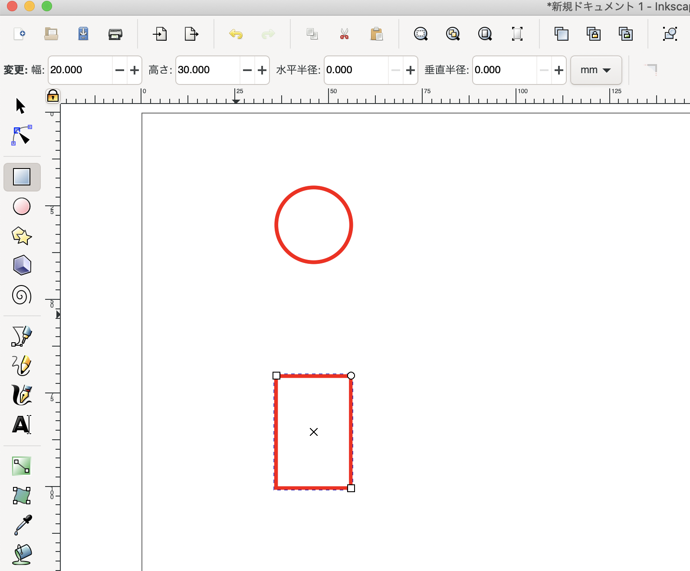
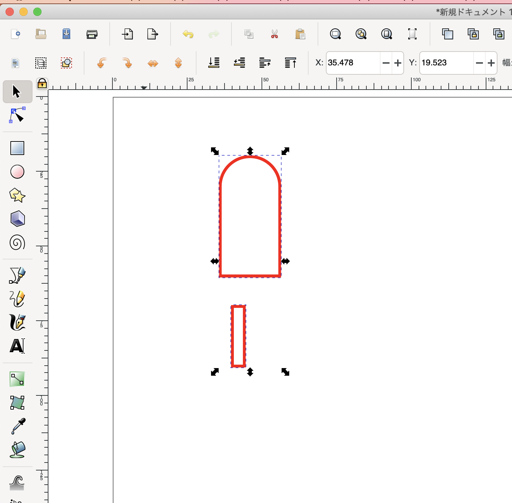

# **(1) スタンプの作成**

基本操作を学んでいきましょう。今回は4mm厚の板材を使用してスタンプを作ります。

<table>
  <tr>
   <td>

   </td>
   <td>1

ドキュメントのプロパティでページサイズを設定。

今回は、幅150、高さ150（単位mm）とする。
   </td>
  </tr>
  <tr>
   <td>

   </td>
   <td>2

ページサイズ変更されました。
   </td>
  </tr>
  <tr>
   <td>

   </td>
   <td>3

円/弧ツールで円を描く。描いたら、上部の変更欄の水平半径と垂直半径に、どちらも「10」と入力する。
   </td>
  </tr>
  <tr>
   <td>

   </td>
   <td>4

選択ツールで円を選択したまま、フィル/ストロークウィンドウで、フィルを「塗りなし」に設定する。
   </td>
  </tr>
  <tr>
   <td>

   </td>
   <td>5

ストロークの塗りを、R 255、G 0、 B 0に設定する。
   </td>
  </tr>
  <tr>
   <td>

   </td>
   <td>6

ストロークのスタイルを、幅「0.001」mmに設定する。
   </td>
  </tr>
  <tr>
   <td>

   </td>
   <td>7

矩形ツールで四角形を描く。描いたら、上部の変更欄の幅に「20」、高さに「30」と入力する。
   </td>
  </tr>
  <tr>
   <td>

   </td>
   <td>8

円と四角形をどちらも選択する。
   </td>
  </tr>
  <tr>
   <td>

   </td>
   <td>9

上部メニューの“オブジェクト”から“整列と配置”を選択する。
   </td>
  </tr>
  <tr>
   <td>

   </td>
   <td>10

垂直方向、水平方向にどちらも中心で整列させる。
   </td>
  </tr>
  <tr>
   <td>

   </td>
   <td>11

四角形の上部が、円の中心にくるように移動させる。
   </td>
  </tr>
  <tr>
   <td>

   </td>
   <td>12

円と四角形を両方選択する。
   </td>
  </tr>
  <tr>
   <td>

   </td>
   <td>13

上部メニューの“パス”から“統合”を選択する。
   </td>
  </tr>
  <tr>
   <td>

   </td>
   <td>14

二つの図形が合体する。
   </td>
  </tr>
  <tr>
   <td>

   </td>
   <td>15

幅「3.8mm」、高さ「20mm」の四角形を描く。
   </td>
  </tr>
  <tr>
   <td>

   </td>
   <td>16

先ほど書いた図形と四角形を一緒に選択し、垂直方向は中心、水平方向は下揃えで整列させる。
   </td>
  </tr>
  <tr>
   <td>

   </td>
   <td>17

16で作成した図形を複製（コピー&ペースト）する。
   </td>
  </tr>
  <tr>
   <td>

   </td>
   <td>18

17で複製した図形を選択し、水平方向を上揃えで整列させる。
   </td>
  </tr>
  <tr>
   <td>

   </td>
   <td>19

はじめに作成した方の図形を選択し、上部メニューの“パス”から“差分”を選択する。
   </td>
  </tr>
  <tr>
   <td>

   </td>
   <td>20

複製した方の図形を選択し、上部メニューの“パス”から“差分”を選択する。
   </td>
  </tr>
  <tr>
   <td>

   </td>
   <td>21

持ち手部分の図形が作成された。
   </td>
  </tr>
  <tr>
   <td>

   </td>
   <td>22

円/弧ツールで円を描く。描いたら、上部の変更欄の水平半径と垂直半径に、どちらも「30」と入力する。
   </td>
  </tr>
  <tr>
   <td>

   </td>
   <td>23

22で描いた円を複製する。
   </td>
  </tr>
  <tr>
   <td>

   </td>
   <td>24

矩形ツールで、幅「20mm」、高さ「3.8mm」の長方形を描く。
   </td>
  </tr>
  <tr>
   <td>

   </td>
   <td>25

24で描いた長方形を複製する。
   </td>
  </tr>
  <tr>
   <td>

   </td>
   <td>26

複製した方の長方形を選択する。
   </td>
  </tr>
  <tr>
   <td>

   </td>
   <td>27

上部メニューの“オブジェクト”から“「90°回転、時計回り」を選択する。
   </td>
  </tr>
  <tr>
   <td>

   </td>
   <td>28

2つの長方形を選択し、水平方向、垂直方向どちらも中心に整列させる。
   </td>
  </tr>
  <tr>
   <td>

   </td>
   <td>29

2つの長方形を選択し、上部メニューの“パス”から“統合”を選択する。
   </td>
  </tr>
  <tr>
   <td>

   </td>
   <td>30

29で作成した図形と、先ほど描いた円形のうちの1つを選択し、水平方向、垂直方向どちらも中心に整列させる。
   </td>
  </tr>
  <tr>
   <td>

   </td>
   <td>31

2つの図形を選択したまま、上部メニューの“オブジェクト”から“グループ”を選択する。
   </td>
  </tr>
  <tr>
   <td>

   </td>
   <td>32

全ての図形を良い感じに並べたら、スタンプのベースの完成！
   </td>
  </tr>
</table>
