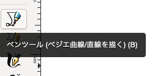
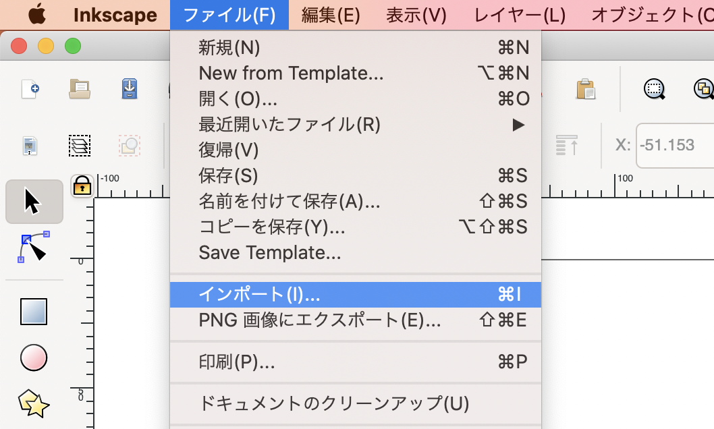
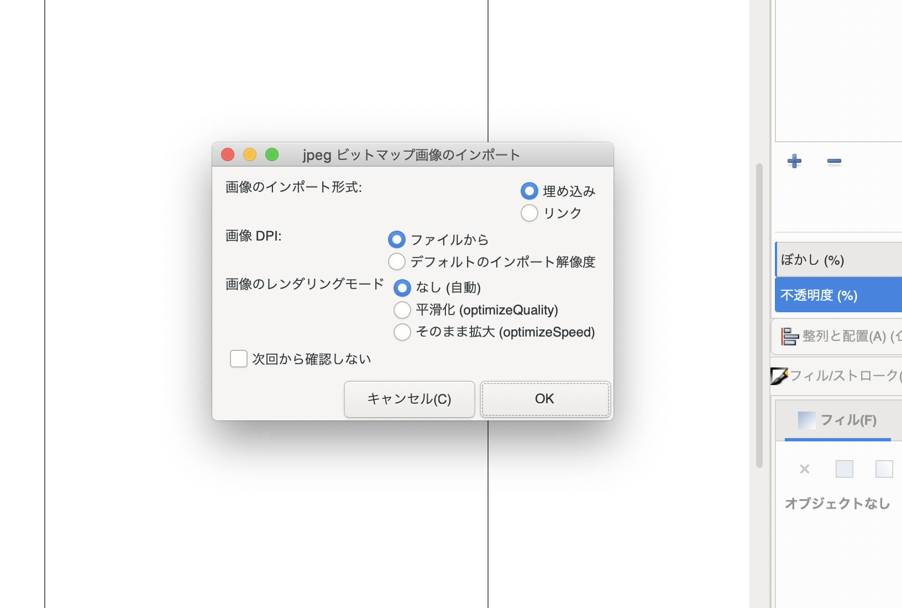
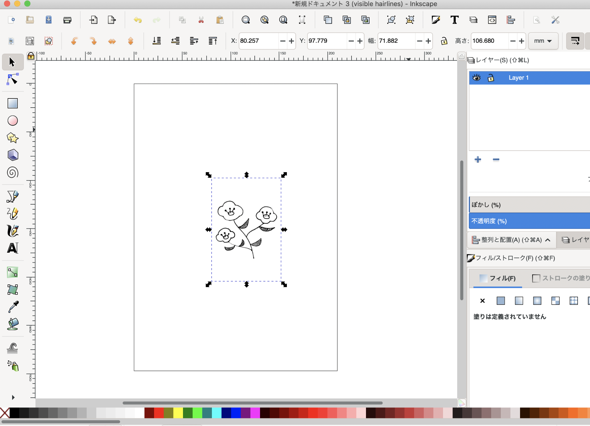
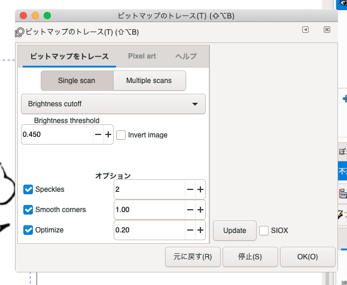
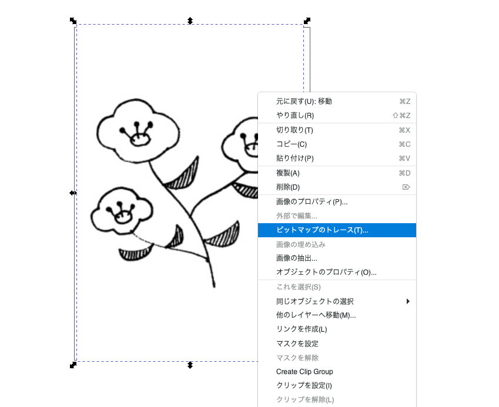

# **(2) 便利な機能**

*   ペンツール
図形や線だけでは表せない、複雑な形状を描くことができる。

*   トレース機能
jpg等のラスター画像を、自動的にベクター画像に変換してくれる。
・Single scan：単色でトレース
・Multiple scans：カラーでトレース
（参照：[https://inkscape.org/ja/doc/tutorials/tracing/tutorial-tracing.html](https://inkscape.org/ja/doc/tutorials/tracing/tutorial-tracing.html)）

## **↓**

 ## **↓**

 ## **↓**

 ## **↓**

簡単な単色でのトレースであれば、Inkscapeの機能ではなく、Webツールなどを使用するのも一つの手です。
(例) Free SVG Converter [https://picsvg.com/](https://picsvg.com/)
*   クリップ機能
上に配置した（作成した）画像の形状で、下の画像を切り抜いてくれる。
（※レーザーカッターやカッティングプロッタ等での加工用データ作成時には、あまり使用しないほうが良いかと思います。）
*   フィルター
オブジェクトの見た目を変えてくれる機能。
*   エクステンション
Inkscapeの拡張機能。
[https://inkscape.org/gallery/=extension/](https://inkscape.org/gallery/=extension/)
